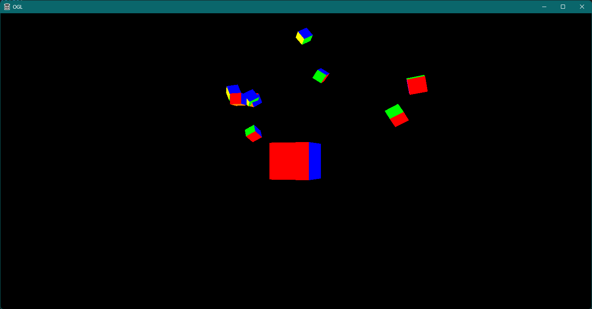
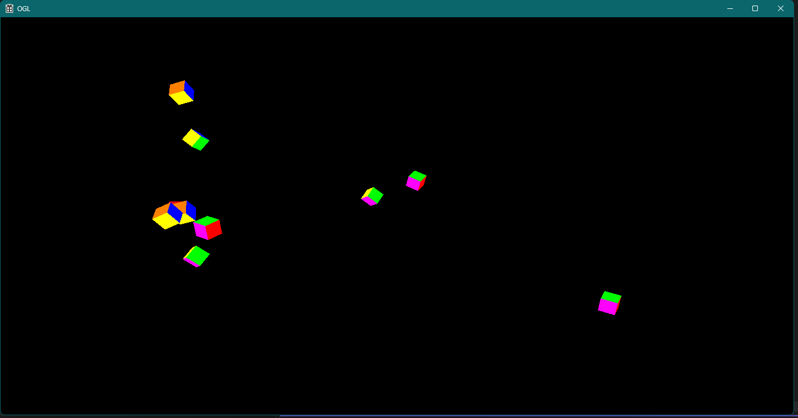
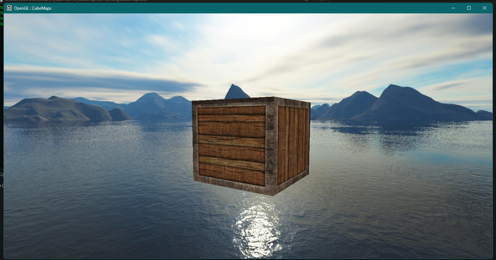
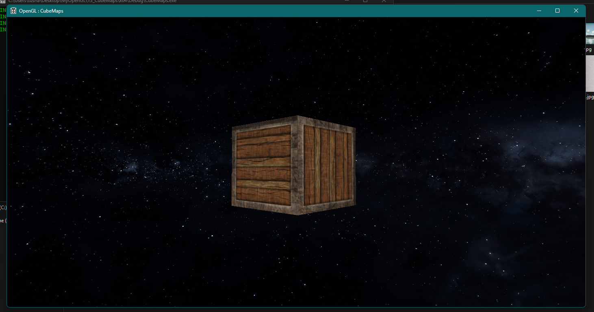

# OpenGL-CameraAndCubemaps

## Description

This repository demonstrates the use of a camera and cubemaps in OpenGL using C++ and GLSL. It contains two separate implementations: a first-person camera and a dynamic environment mapping implementation using cubemaps.

## Screenshots

`Camera`


`Cubemaps`



## Video Demo

[](https://youtu.be/BqgV6869cAs)

## Folder Structure

*   `01_Camera`: Contains the first-person camera implementation.
    *   `Camera/x64/Debug`: Contains build files and output executables.
    *   `resources`: Contains texture and model assets.
    *   `shaders`: Contains GLSL shader programs.
    *   `x64/Debug`: Contains debug build output.
*   `02_Cubemaps`: Contains the cubemap implementation.
    *   `Cubemaps/x64/Debug`: Contains build files and output executables.
    *   `resources`: Contains cubemap texture assets.
    *   `shaders`: Contains GLSL shader programs for environment mapping.
    *   `x64/Debug`: Contains debug build output.
*   `.gitignore`: Specifies intentionally untracked files.

## Dependencies

Before building and running this project, you need to install the following dependencies:

*   **GLEW (OpenGL Extension Wrangler Library):** Download GLEW and add the `include` directory and library files (e.g., `glew32.lib`) to your system environment variables.
*   **GLM (OpenGL Mathematics):** Download GLM. GLM is a header-only library, so simply copy the `glm` directory into your project's include path.

**Note:** Adding GLEW and GLM to your system environment variables ensures that Visual Studio can find them during the build process. This typically involves adding paths to the `INCLUDE` and `LIB` environment variables.

## Build Instructions (Visual Studio 2022)

Follow these steps to build the project using Visual Studio 2022:

1.  **Clone the Repository:** Clone this repository to your local machine using the following command:
    ```bash
    git clone https://github.com/Tushar-Wagdare/OpenGL-CameraAndCubemaps.git
    ```
2.  **Open the Solution:** Open the `OGL.sln` file in Visual Studio 2022 within either the `01_Camera` or `02_Cubemaps` folder, depending on which implementation you want to build.
3.  **Build the Solution:** Go to `Build` -> `Build Solution` (or press `Ctrl+Shift+B`).
4.  **Ensure all dependencies are present:** Make sure all the dependencies are installed and placed in the system environment.
5.  **Run the Solution:** After building, run the executable located in the respective `x64/Debug` directory.

## Usage

After successfully building the project, you can run the executable located in the `x64/Debug` directory within either the `01_Camera` or `02_Cubemaps` folder.

*   **01_Camera:** Explore a 3D scene using a first-person camera.
*   **02_Cubemaps:** Observe dynamic environment mapping using cubemaps.
